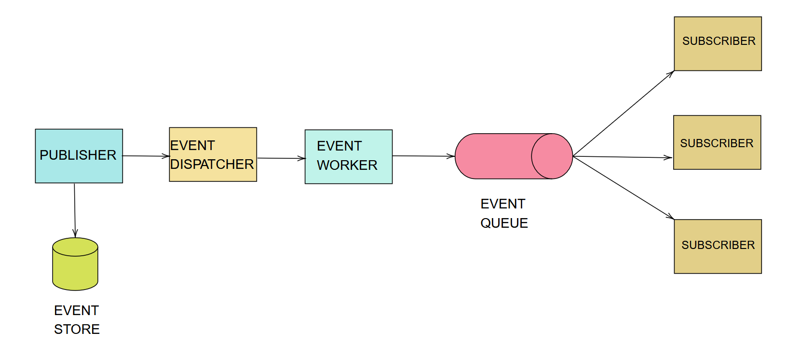

# Reflux

> A lightweight, concurrent Event Bus framework for decoupled system design.

---

## Overview

Reflux is an event-driven communication framework designed to enable **loosely coupled interaction** between components. Instead of direct method calls, components communicate through events, improving modularity and scalability.

The system is built with:
- **Concurrency in mind**
- **Multithreaded execution**
- **Deadlock-free design principles**

---

## Why Reflux?

Modern systems require components to evolve independently without tight coupling. Reflux addresses this by introducing an event-driven architecture where:

- Producers emit events  
- Consumers react asynchronously  
- The system remains extensible and maintainable  

---

## Core Concepts

### Event
A simple data object representing a system occurrence.

```java
class UserCreatedEvent {
    String username;
}
```

---

### Publisher
Emits events into the system.

```java
eventBus.publish(new UserCreatedEvent("Animesh"));
```

---

### Subscriber
Listens and reacts to specific events.

```java
@Subscribe
public void onUserCreated(UserCreatedEvent event) {
    System.out.println("User created: " + event.username);
}
```

---

### Event Bus
The central coordinator responsible for:
- Registering subscribers  
- Mapping events to handlers  
- Dispatching events efficiently  

---

## Workflow

1. **Initialize the Event Bus**
   ```java
   EventBus eventBus = new EventBus();
   ```

2. **Register Subscribers**
   - Reflection identifies methods annotated with `@Subscribe`
   - Event-handler mappings are stored internally

3. **Publish Event**
   ```java
   eventBus.publish(event);
   ```

4. **Dispatch**
   - Event type is resolved  
   - Matching subscribers are invoked  

---

## Architecture



---

## Event Store & Replay Mechanism

Reflux includes an **Event Store** that enhances reliability and debugging capabilities.

- All events can be optionally persisted  
- Failed or unprocessed events are stored  
- Events can be **replayed** to reproduce system behavior  
- Useful for debugging, auditing, and recovery  

This ensures that no critical event is permanently lost and provides better observability into the system.

---

## Concurrency Model

Reflux is designed to operate efficiently under concurrent workloads.

- **Multithreaded Execution**  
  Events can be processed in parallel using worker threads  

- **Thread Safety**  
  Internal data structures are managed to avoid race conditions  

- **Deadlock-Free Design**  
  No cyclic dependencies or blocking chains in dispatch logic  

- **Asynchronous Processing**  
  Supports non-blocking event handling  

---

## Features

- Loose coupling between components  
- Dynamic subscription mechanism  
- Multiple subscribers per event  
- Strongly typed events  
- Concurrent event handling  
- Event persistence and replay support  

---

## Example

```java
class OrderPlacedEvent {
    int orderId;
}

class NotificationService {
    @Subscribe
    public void sendNotification(OrderPlacedEvent event) {
        System.out.println("Order placed: " + event.orderId);
    }
}

eventBus.init("base package name");
eventBus.publish(new OrderPlacedEvent(101));
```

**Output**
```
Order placed: 101
```

---

## When to Use

Use Reflux if your system:
- Has multiple interacting components  
- Requires scalability  
- Benefits from asynchronous communication  

Avoid if:
- Direct calls are sufficient  
- Ultra-low latency is critical  

---

## Design Notes

Reflux focuses on:
- Simplicity over heavy abstraction  
- Performance under concurrency  
- Clean separation of concerns  

---

## Author

Animesh Sharma
